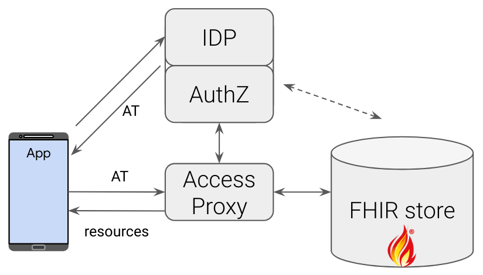

# FHIR Access Proxy

This is a simple access-control proxy that sits in front of a
[FHIR](https://www.hl7.org/fhir/) store (e.g., a
[HAPI FHIR](https://hapifhir.io/) server,
[GCP FHIR store](https://cloud.google.com/healthcare-api/docs/concepts/fhir),
etc.) and controls access to FHIR resources.

The authorization and access-control have three components; one of them is this
access proxy. The other two are an Identity Provider (IDP) and an Authorization
server (AuthZ). The responsibility of this pair is to authenticate
the user and issue access tokens (in JWT format and using authorization flow of
OAuth 2.0). The requests to the access proxy should have the access token as a
Bearer Authorization header. Based on that, the proxy decides whether to grant
access for a FHIR query.



The initial design doc for this work is available
[here](https://docs.google.com/document/d/14YnCTzsaTj-WGWIV_VF5QERl5_XV2UriHwtnor0FKoo/edit).
<!--- TODO: create a public version of this doc. --->

# Modules
The proxy consists of a core, which is in the [server](server) module, and a
set of _access-checker_ plugins, which can be implemented by third parties and
added to the proxy server. Two sample plugins are implemented in the
[plugins](plugins) module. To build both modules, from the root run:
```shell
mvn package
```
This creates an executable server and a plugin jar which can be run together:
```shell
java -Dloader.path="plugins/target/plugins-0.1.0.jar" \
  -jar server/target/server-0.1.0-exec.jar --server.port=8081
```
The plugin library can be swapped with any third party access-checker as
described in the [plugins](plugins) directory. If you prefer to combine
everything into a single standalone jar, you can do:
```shell
mvn package -Pstandalone-app
```
and then run:
```shell
java -jar plugins/target/plugins-0.0.1-exec.jar --server.port=8081
```

# Proxy setup

The proxy configuration parameters are currently provided through environment
variables:

- **FHIR store location**: This is set by `PROXY_TO` environment
  variable, using the base url of the FHIR store e.g.:
  ```shell
  export PROXY_TO=https://example.com/fhir
  ```

- **Access token issuer**: This is set by `TOKEN_ISSUER` variable, e.g.:
  ```shell
  export TOKEN_ISSUER=http://localhost:9080/auth/realms/test
  ```
  The above example is based on the default config of a test IDP+AuthZ
[Keycloak](https://github.com/Alvearie/keycloak-extensions-for-fhir) server.
To see how this server is configured, check the
[docker/keycloak](docker/keycloak) directory. If you want to use a
SMART-on-FHIR app use this realm instead:
  ```shell
  export TOKEN_ISSUER=http://localhost:9080/auth/realms/test-smart
  ```

- **AccessChecker**: As mentioned above, access-checkers can be provided as
plugins and easily swapped. Each access-checker has a name
(see [plugins](plugins) for details) and `ACCESS_CHECKER` variable should
be set to this name. For example, the two plugins that are provided in this
repository, can be selected by either of:
  ```shell
  export ACCESS_CHECKER=list
  export ACCESS_CHECKER=patient
  ```
  
- **AllowedQueriesChecker**: There are URL requests that the server can allow 
   without going through an access checker. [`AllowedQueriesChecker`](https://github.com/google/fhir-access-proxy/blob/main/server/src/main/java/com/google/fhir/proxy/AllowedQueriesChecker.java)
   is a special `AccessChecker` that compares the incoming request with a configured set of
   allowed-queries. The intended use of this checker is to override all other
   access-checkers for certain user-defined criteria. The user defines their
   criteria in a config file and if the URL query matches an entry in the
   config file, access is granted. An example of this is:
   [`hapi_page_url_allowed_queries.json`](https://github.com/google/fhir-access-proxy/blob/main/resources/hapi_page_url_allowed_queries.json).
   To use the file, set the `ALLOWED_QUERIES_FILE` variable:
    ```shell
    export ALLOWED_QUERIES_FILE="resources/hapi_page_url_allowed_queries.json"
    ```

- The proxy makes no assumptions about what the FHIR server is, but the proxy
should be able to send any FHIR queries to the server. For example, if you use a
[GCP FHIR store](https://cloud.google.com/healthcare-api/docs/concepts/fhir)
you have the following options:
  * If you have access to the FHIR store, you can use your own credentials by
  doing [application-default login](https://cloud.google.com/sdk/gcloud/reference/auth/application-default/login).
  This is useful when testing the proxy on your local machine, and you have
  access to the FHIR server through your credentials.
  * Use a service account with required access (e.g.,
  "Healthcare FHIR Resource Reader", "Healthcare Dataset Viewer",
  "Healthcare FHIR Store Viewer"). You can then run the proxy in
  the same GCP project on a VM with this service account.
  * [not-recommended] You can create and download a key file for the above
  service account, then use it with
  ```shell
  export GOOGLE_APPLICATION_CREDENTIALS="PATH_TO_THE_JSON_KEY_FILE"
  ```

Once you have set all the above, you can run the proxy server. By default, the
server uses [Apache Tomcat](https://tomcat.apache.org/) through
[Spring Boot](https://spring.io/projects/spring-boot) and
the usual configuration parameters apply, e.g., to run on port 8081:
```shell
java -jar plugins/target/plugins-0.1.0-exec.jar --server.port=8081
```

## Docker
The proxy is also available as a [docker image](Dockerfile):
```shell
$ docker run -p 8081:8080 -e TOKEN_ISSUER=[token_issuer_url] \
  -e PROXY_TO=[fhir_server_url] -e ACCESS_CHECKER=list \
  gcr.io/second-scion-309318/fhir-proxy:latest
```

Note if the `TOKEN_ISSUER` is on the `localhost` you need  to bypass proxy's
token issuer check by setting `RUN_MODE=DEV` environment variable.

GCP note: if this is not on a VM with proper service account (e.g., on a local
host), you need to pass GCP credentials to it, for example by mapping the
`.config/gcloud` volume (i.e., add `-v ~/.config/gcloud:/root/.config/gcloud` to
the above command).

# How to use this proxy

Once the proxy is running, we first need to fetch an access token from the
`TOKEN_ISSUER`; you need the test `username` and `password` plus the
`client_id`:

```shell
$ curl -X POST -d 'client_id=CLIENT_ID' -d 'username=testuser' \
  -d 'password=testpass' -d 'grant_type=password' \
"http://localhost:9080/auth/realms/test/protocol/openid-connect/token"
```

We need the `access_token` of the returned JSON to be able to convince the proxy
to authorize our FHIR requests (there is also a `refresh_token` in the
above response). Assuming this is stored in the `ACCESS_TOKEN` environment
variable, we can access the FHIR store:

```shell
$ curl -X GET -H "Authorization: Bearer ${ACCESS_TOKEN}" \
-H "Content-Type: application/json; charset=utf-8" \
'http://localhost:8081/Patient/f16b5191-af47-4c5a-b9ca-71e0a4365824'
```

```shell
$ curl -X PUT -H "Authorization: Bearer ${ACCESS_TOKEN}" \
-H "Content-Type: application/json; charset=utf-8" \
'http://localhost:8081/Patient/f16b5191-af47-4c5a-b9ca-71e0a4365824' \
-d @Patient_f16b5191-af47-4c5a-b9ca-71e0a4365824_modified.json
```

Of course, whether a query is accepted or denied, depends on the access-checker
used and the `ACCESS_TOKEN` claims. For example, for `ACCESS_CHECKER=list` there
should be a `patient_list` claim which is the ID of a `List` FHIR resource with
all the patients that this user has access to. For `ACCESS_CHECKER=patient`,
there should be a `patient_id` claim with a valid Patient resource ID.

# Acknowledgement
This proxy is implemented as a
[HAPI FHIR Plain Server](https://hapifhir.io/hapi-fhir/docs/server_plain/introduction.html),
starting from this
[hapi-fhirstarters-simple-server](https://github.com/FirelyTeam/fhirstarters/tree/master/java/hapi-fhirstarters-simple-server)
example.
