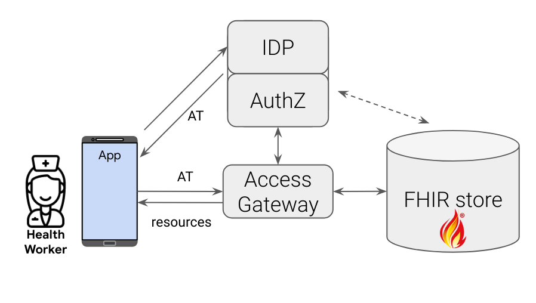
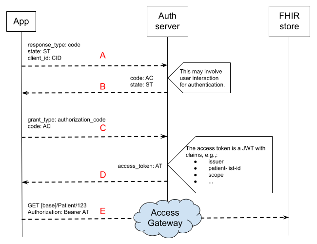
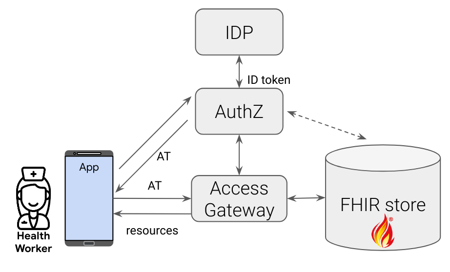
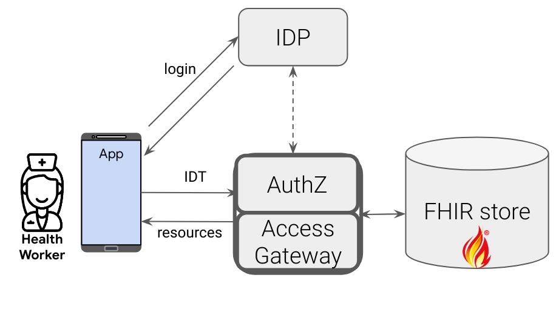

# Secure FHIR Data Access Design Doc

In the context of healthcare data systems in resource constrained environments

GitHub repository: https://github.com/google/fhir-gateway

## Summary

### The problem

We want to create an access-control _gateway_ that is deployable in front of any
generic [FHIR](https://www.hl7.org/fhir/) server. The job of this gateway is to
let authenticated users access only what they are authorized to. In most cases,
this gateway acts as a reverse proxy. We want this proxy server to be scalable,
independent of the FHIR store implementation, and deployable both on-premise and
in any cloud. We also want the access rules to be customizable and fine-grained.
For more context, please see the [Introduction](#introduction) section.

### Summary of the approach

Here is a summary of proposals and decisions in this design document, for the
first version (V1) of the FHIR gateway:



- There are three main components responsible for access decisions: an Identity
  Provider (IDP) which authenticates the user, an Authorization server (AuthZ)
  that decides what a given user can access and an Access Gateway which enforces
  those permissions. We are implementing the access gateway.
- The gateway has two main components: (i) a core "_server_" piece which
  provides the servlets, interceptors, FHIR query processor, and other common
  pieces to any access-control strategy and (ii) a customizable `AccessChecker`
  "_plugin_".
- The authorization flow is based on the "authorization code flow" of OAuth 2.0.
  This resembles [SMART on FHIR spec](http://www.hl7.org/fhir/smart-app-launch/)
  (SoF) but is not limited to it. In particular, some access-checker plugins may
  rely on extra claims in the access token not defined in SoF. We did this
  because the access controls captured in SoF did not seem sufficiently
  expressive for a lot of use cases we have observed.
- We currently provide two example, default plugins: one that supports parts of
  the SoF spec for patient context/scopes and one that is a simple list-based
  access-checker.
- For access control rules, a plugin can choose to implement anything but there
  is some functionality provided out-of-the-box by the server code that should
  cover many cases:
  - For FHIR queries scoped to a single (or group of) patients, there is a
    library to extract referenced patient(s) from the query/resources, based on
    the
    [Patient Compartment](https://hl7.org/fhir/compartmentdefinition-patient.html)
    definition. The expectation is that most access-control rules come down to
    deciding whether the user has access to that patient data or not. The plugin
    makes this decision.
  - For searches beyond patient boundaries, define a set of templates to allow
    or reject access based on the query string (i.e., the "_allow list_").
- We assume that the IDP+AuthZ together establish the user's identity and access
  rules in a token of [JWT](https://en.wikipedia.org/wiki/JSON_Web_Token) type.
  This "access token" should accompany requests to the gateway.
- The gateway will be implemented using HAPI FHIR libraries and is the main
  focus of this design doc.
- The authorization server may implement authentication too or it may rely on a
  separate authentication service that supports
  [OpenID Connect spec](https://openid.net/connect/). Those details are beyond
  this design doc.
- The server and plugin parts of the gateway will be released as libraries and
  there would also be a sample "main" Spring Boot application which packages
  everything in a single executable jar. This is easily deployable as a docker
  container too.

## Introduction

The context of this document is implementation of access controls for
[FHIR](https://www.hl7.org/fhir/) resources. In particular, the focus is on web
or mobile apps used by healthcare workers (HCW) who are often in low
connectivity settings. For example a community health worker (CHW) collects data
from patients and needs to sync that data with a central FHIR store. While our
design is meant to be generic, we want to have great support for apps built on
top of the [Android FHIR SDK](https://github.com/google/android-fhir) ("the
SDK"). Data collected by all CHWs is centralized in a backend FHIR store
(a.k.a., _resource server_, e.g., a
[GCP FHIR store](https://cloud.google.com/healthcare/docs/concepts/fhir) or a
[HAPI FHIR server](https://hapifhir.io/)). The core issue is how to securely
synchronize data between the FHIR store and the devices (the _data-sync_
problem). The security question has three main components:

1.  [**authentication**] Who the user is? How do we establish the identity of
    the end-user?
2.  [**authorization**] Given the identity of the user, what accesses are
    granted to them? For example, a program administrator may have access to all
    data while a CHW only has access to certain patient information in their own
    catchment area.
3.  [**access-control**] How do we impose restrictions on FHIR store access
    based on authorization credentials? For example, how do we make sure that an
    authorized CHW can only access data for their own catchment area.

The third component (i.e., the access-control) is the main focus of this design
doc. The authentication and authorization parts are very much related to each
other and we may refer to them collectively as authorization or "auth". For the
auth problem, we only consider OAuth 2.0 based solutions and in particular we
try to follow [SMART on FHIR](http://www.hl7.org/fhir/smart-app-launch/) (SoF)
spec for two main reasons:

1.  If we implement SoF support, it opens up the possibility of incorporating
    many other SoF based applications with the FHIR-store. Consider a
    practitioner that can easily use a 3rd party growth chart app on the data
    they have already collected through their FHIR SDK based app.
2.  SoF is becoming the FHIR community's standard to build client apps on top of
    FHIR-stores. So while in some places we have to deviate from that spec
    because of its shortcomings, in many other places, we can simply follow the
    recommendations of the spec to benefit from best practices.

Note that the more difficult part of the problem that we are trying to solve is
access-control which is not directly addressed by SoF, as clearly stated in
[section 3.0.1.1 of the current spec](https://www.hl7.org/fhir/smart-app-launch/scopes-and-launch-context.html#smarts-scopes-are-used-to-delegate-access):

> "_Neither SMART on FHIR nor the FHIR Core specification provide a way to model
> the "underlying" permissions at play here; this is a lower-level
> responsibility in the access control stack. As such, clients can attempt to
> perform FHIR operations based on the scopes they are granted — but depending
> on the details of the underlying permission system (e.g., the permissions of
> the approving user and/or permissions assigned in a client-specific policy)
> these requests may be rejected, or results may be omitted from responses._"

### Scenarios and constraints

Some of the main scenarios that need to be supported are:

- [**add-patient**] A HCW registers a new patient, this needs to be sent to the
  FHIR server. The HCW might be offline at the time of registration.
- [**update-patient**] Patient data is updated, e.g., a new Observation is added
  by a HCW. Again the HCW might be offline at the time of data entry and many
  updates might be communicated to the backend FHIR store at the time of server
  synchronization.
- [**fetch-my-patients**] A HCW needs all updates to their patients, e.g.,
  because they have switched their device or another HCW has updated the same
  patient's data.
- [**revoke-access**] Revoke a previously issued (and still valid)
  access/refresh token.
- [**sof-apps**] It should be easy to support other SoF-based apps. For example,
  a patient wants to browse their own data through a 3rd party SoF-based app.
  For now, we limit this scenario to apps that only need `patient/*` scopes.

Constraints:

- [**flexible-access-control**] Enforce principle of least-privilege and
  fine-grained access controls. For example, a HCW should have access only to
  their own patients. A check could be implemented by looking at patients whose
  <code>[Patient](https://www.hl7.org/fhir/patient.html).generalPractitioner</code>

  references that HCW; or are in the region assigned to that HCW (using
  Location, Organization, CareTeam, etc.). We may want to limit HCW's access to
  some Observation types.

- [<strong>untrusted-app</strong>] The app cannot be assumed to be trusted; so
  we should account for malicious access from the app; or abusing access tokens
  issued for the app.
- [<strong>generalizable-design</strong>] The access gateway should be
  independent of the specific FHIR server implementation, as much as possible.

## The high level design

Here we look at the big picture of the components involved and the main flow for
accessing data. In subsequent sections we focus on the access gateway.

### Terminology and the big picture

Before going into details, let's clarify some terminology:

- **Client**: The mobile or web app requesting access to resources. In the OAuth
  2.0 sense, we mainly mean "public clients", i.e., there is no "client secret"
  shared by the server.
- **Access token**: A string that can be used to access resources. While this
  can be an "opaque" string, we use
  [JSON Web Token (JWT)](https://en.wikipedia.org/wiki/JSON_Web_Token)
  throughout this design.
  - **Authorization flow**: Different ways for getting access tokens; our main
    focus in this design is the
    "[authorization code flow](https://auth0.com/docs/get-started/authentication-and-authorization-flow/authorization-code-flow)"
    but without any client secrets.
- **Refresh token**: A token for fetching a new access token when the old one
  expires.
- **Identity Provider (IDP)**: A [potentially shared] server to establish user
  identity, e.g., Google, Twitter, GitHub, etc.
- **Authorization server**: A service that maps the user identity to some access
  rules for FHIR store resources. In our design, this mapping is recorded in the
  access token.
- **OpenID Connect**: An OAuth 2.0 based standard used by IDPs.
- **ID token**: A JWT issued by IDP proving the identity of the user
- **Claims**: Key-value pieces of information in JWTs
- **Scopes**: A set of predefined access rules to define what resources can be
  accessed by an access token. These are represented as claims in the access
  JWT.

In our overall design, we treat IDP and authorization server as one whole,
sometimes referred to as the Identity and Access Management (IAM) or simply
"auth server". Obviously, IDP can be a separate (or even 3rd party) service
(there are various architecture options briefly mentioned later).

We also have an "access gateway" which is responsible for processing any access
request for the FHIR server and is the main focus of this design doc.


### Authentication and authorization flow

Before the user can access data, their identity should be established and based
on that, the authorization scope be defined. Because the main focus of this doc
is the access gateway, we keep this section brief. This is just to demonstrate
the big picture and some best practices when deploying IDP and AuthZ servers.

One of the recommended authorization flows and the one we consider here is the
[Authorization Code Flow](https://auth0.com/docs/get-started/authentication-and-authorization-flow/authorization-code-flow).
Since our main target is mobile (or single-page) apps that do not necessarily
have a server side piece (a.k.a.
"[public clients](https://oauth.net/2/client-types/)"), we consider the flow
with no client secrets. This flow resembles
[SMART on FHIR standalone app launch](https://www.hl7.org/fhir/smart-app-launch/app-launch.html#launch-app-standalone-launch)
spec. There are at least three components we care about:

- the CHW app
- the auth service which is responsible for establishing the identity of the
  user and authorizing access tokens.
- the FHIR resource server (e.g., GCP FHIR store or a HAPI FHIR server)

Here is a simplified view of the authorization sequence (note it is recommended
to use
[PKCE](https://auth0.com/docs/authorization/flows/authorization-code-flow-with-proof-key-for-code-exchange-pkce)
which is not shown in this diagram)[^1]:



Here is a brief description of each step:

- A) The app makes a request to the auth server asking for an **authorization
  code** (hence `response_type=code` parameter). This is a short lived code that
  is sent back to the app if the user authentication is successful. This step
  may involve some user interactions to establish the identity of the user and
  pick a patient if the user has access to multiple patients.
- B) If the authentication/authorization is successful, the app receives the
  authorization code AC. The optional parameter `state` is recommended to be
  used in steps A and B for added security (to prevent replay attacks). In that
  case, the app and auth server verify the `state`.
- C) The app asks for an exchange of AC with an **access token**.

- D) The auth server verifies AC and on success returns an access token AT,
  along with the approved scopes and other authorization claims needed for
  access control.

- E) The app uses the access token AT to read patient related resources from the
  FHIR store. At this point, the gateway imposes the access-control restrictions
  implied by AT.

### Other architectures

Before getting into details of how the access gateway works, let's look at other
architectures where the main 3 components can be deployed. In all options, it is
assumed that the IDP is an [OpenID Connect](https://openid.net/connect/)
compliant service.

**Separate IDP**

If desired, the IDP can be separated and a third-party shared service be used.
In this case, IDP provides an
[ID token](https://developer.okta.com/blog/2017/07/25/oidc-primer-part-1#id-tokens)
to AuthZ which in turn maps the user identity to some access rules to FHIR
resources. Popular IAM servers like [Keycloak](https://www.keycloak.org/),
support separate/3rd party IDPs.



**Integrated AuthZ+Gateway**

It is also possible to only have the IDP as an external service. In this case,
the access gateway and AuthZ are the same service. All that this service needs
is an ID token from the IDP. Based on the user identity (e.g., their email
address) the service decides what resources they have access to. This approach
simplifies the deployment architecture significantly, however we note that the
elimination of the access token might be incompatible with some use-cases like
SoF apps.



## Access gateway

Assume that we have established the identity of the end-user and authorized them
for certain access scopes. Now, we should make sure that authorized requests do
not access information beyond what the user is granted to. This is done by the
Access Gateway which sits between the app and FHIR store. This is where all ACLs
are applied; here are some examples we want to eventually support:

- For a practitioner, only access to their own patients are granted. The
  definition of one's patients could be configured through implementation of the
  access-checker plugin. For example:
  - Patients in a specific FHIR List resource.
  - Any patient in CHW's catchment area.
  - Any patient whose `generalPractitioner` contains that CHW.
- Observations of sensitive types can only be accessed by certain users.
- For a patient user, only access to their own data is granted and SoF scopes
  rules are imposed too.

Note we are not assuming any access-control support from the FHIR store itself
because of the **generalizable-design** [constraint](#scenarios-and-constrants).

It is a good idea to look at a few FHIR query examples and their access control
challenges before diving into solutions. Some examples are provided in the
[query examples appendix](#fhir-query-examples-and-access-control-challenges).
We propose four main approaches for access control:

- **Patient context enforcement**: Limit queries to data for a single patient
- **Query templates**: Limit the non-patient queries to a small number of
  templates.
- **Query rewrite**: Send a modified query to the FHIR store which guarantees
  access-control requirements.
- **Post processing**: Post process FHIR store results and redact sensitive
  information.

By providing developers the ability to customize each of these, we believe that
this gateway can support many different models of access control, which often
varies by context.

Each of these approaches are described in the following sections. In each case,
we briefly describe what is supported in the first release of the access
gateway. The "first release" is when we open-sourced the project in June 2022 in
[this GitHub repository](https://github.com/google/fhir-access-proxy). Let's
first look at the architecture of the gateway. There are two main components:

**[Server](https://github.com/google/fhir-access-proxy/tree/main/server/src/main/java/com/google/fhir/gateway)**:
The core of the access gateway is the "server" which provides a
[servlet](https://github.com/google/fhir-access-proxy/blob/main/server/src/main/java/com/google/fhir/gateway/FhirProxyServer.java)
that processes FHIR queries and an
[authorization interceptor](https://github.com/google/fhir-access-proxy/blob/main/server/src/main/java/com/google/fhir/gateway/BearerAuthorizationInterceptor.java)
that inspects those. The interceptor decodes and validates the JWT access-token
and makes a call to an
[AccessChecker](https://github.com/google/fhir-access-proxy/blob/main/server/src/main/java/com/google/fhir/gateway/interfaces/AccessChecker.java)
plugin to decide whether access should be granted or not. The server also
provides common FHIR query/resource processing, e.g.,
[PatientFinder](https://github.com/google/fhir-access-proxy/blob/main/server/src/main/java/com/google/fhir/gateway/interfaces/PatientFinder.java)
for finding patient context. These libraries are meant to be used in the plugin
implementations.

**[AccessChecker plugin](https://github.com/google/fhir-access-proxy/tree/main/plugins)**:
Each access gateway needs at least one AccessChecker plugin. Gateway
implementers can provide their customized access-check logic in this plugin. The
server code's initialization finds plugins by looking for
[AccessCheckerFactory](https://github.com/google/fhir-access-proxy/blob/main/server/src/main/java/com/google/fhir/gateway/interfaces/AccessCheckerFactory.java)
implementations that are
[@Named](https://docs.oracle.com/javaee/7/api/javax/inject/Named.html). The
specified name is used to select that plugin at runtime. Example implementations
are
[ListAccessChecker](https://github.com/google/fhir-access-proxy/blob/main/plugins/src/main/java/com/google/fhir/gateway/plugin/ListAccessChecker.java)
and
[PatientAccessChecker](https://github.com/google/fhir-access-proxy/blob/main/plugins/src/main/java/com/google/fhir/gateway/plugin/PatientAccessChecker.java).
AccessChecker plugins can send RPCs to other backends if they need to collect
extra information. In our examples, the plugins consult with the same FHIR store
that resources are pulled from, but you could imagine consulting more hardened
storage solutions dedicated to maintaining access control rules.

With this general architecture in mind, now let's look at different
access-control methods.

### Patient context enforcement

Most of the use-cases we have can be handled if we limit a query to a single
patient's resource. For example an Observation search query with a `patient=PID`
query parameter, guarantees that the result is for the given patient.

The mapping from resources to patients is done through the
[patient compartment](https://www.hl7.org/fhir/compartmentdefinition-patient.html)
definition. Note that we can still access many resources in one query; in
particular through
[Patient/ID/\$everything](https://hl7.org/fhir/patient-operation-everything.html)
queries, we can fetch all updates for a single patient.

This approach helps support both the **flexible-access-control** and
**untrusted-app** items from the [constraints](#scenarios-and-constraints)
section. Note to use this approach for access-control, the patient context
should be inferred from the FHIR query. The server provides
[a library](https://github.com/google/fhir-access-proxy/blob/main/server/src/main/java/com/google/fhir/gateway/PatientFinderImp.java)
for doing this.

### Query templates allowed/blocked list

We may need to expose FHIR data that cannot be represented in a patient
compartment query. For example, fetching a particular non-patient resource that
is needed on the client side. For these we propose using a small set of allowed
query templates. We can also have a list of blocked templates that may even
apply to patient queries. For example, one implementation may decide to disable
reverse chaining by blocking queries with `_has` query parameters (note this is
disabled by default in the first release for security reasons described in the
[appendix](#appendix).

A notable item needed in the allowed-list for a HAPI FHIR server is the search
page pattern. These queries with a `_getpages` query parameter identify cached
search results of a previous query. Just from these queries, we cannot decide
what the patient context is, so we should let those queries go through (there is
a security risk here but since `_getpages` param values are ephemeral UUIDs,
this is probably ok). Here is a
[sample config](https://github.com/google/fhir-access-proxy/blob/main/resources/hapi_page_url_allowed_queries.json)
for this. We note that we want our core "server" to be _stateless_ (for easy
scalability); therefore cannot store next/prev URLs from previous query results.

### Query rewrite

We can add extra query parameters to a FHIR request to make sure it stays within
the limits of the granted access. For example, we can add constraints to an
Observation search query to exclude sensitive Observations. Or we can add
[security label](https://www.hl7.org/fhir/security-labels.html) constraints in a
search query. Note this feature is not implemented in the first release.

### Post-processing and security labels

Another access-control option is to inspect the returned resources before
sending them back to the client. So the access gateway fetches the resources and
then checks if the user has access to those. For example, when fetching a
resource by ID (e.g., `/Observation/obs-id`) it is impossible to determine the
patient context from the query string. So we can fetch the resource and then
check if the user is allowed to access the patient(s) referenced in that
resource. Or we can apply
[security label](https://www.hl7.org/fhir/security-labels.html) constraints.
Note these imply some non-trivial overhead work for processing FHIR resources.

Note that even this kind of fine-grained control, does not address all of the
sensitive-data scenarios because of reverse chaining (if we do not limit the
structure of FHIR queries that the gateway accepts). So we still need some
restrictions on the permitted queries as mentioned above.

Among gateway interfaces, there is
[AccessDecision](https://github.com/google/fhir-access-proxy/blob/main/server/src/main/java/com/google/fhir/gateway/interfaces/AccessDecision.java)
which is returned from a
[checkAccess](https://github.com/google/fhir-access-proxy/blob/85f7c87a26494d4efba5d01904c8c27074eb26a9/server/src/main/java/com/google/fhir/gateway/interfaces/AccessChecker.java#L31).
This interface has a
[postProcess](https://github.com/google/fhir-access-proxy/blob/85f7c87a26494d4efba5d01904c8c27074eb26a9/server/src/main/java/com/google/fhir/gateway/interfaces/AccessDecision.java#L39)
method which can be used for post-processing of resources returned from the FHIR
server.

## The sync. flow

Here is a demonstration of how a sample HCW app can fetch data from a FHIR
server while access-control policies apply.

- The client app redirects the HCW to the "auth server" (AuthZ+IDP) to
  authenticate the user and annotate their access tokens with required
  authorization claims.
- The client fetches the access token from AuthZ.
- The client sends the access token along with a FHIR query to the access
  gateway.
- The gateway verifies the token and checks that every resource accessed belongs
  to a patient the client is authorized to access and/or is compatible with the
  authorized templates.
- The gateway relays the query to the FHIR store.
- Upon the store's response, the gateway makes any post-processing required and
  returns the outcome to the client.

Through this process, **add-patient**, **update-patient**, and
**fetch-my-patients** [scenarios](#scenarios-and-constraints) can be handled. To
support **sof-apps** (assuming that the auth server supports SoF scopes), we
should implement access control rules based on SoF scopes (which is provided in
a plugin). One example of an auth server with SoF support is
[Keycloak with SoF extension](https://github.com/Alvearie/keycloak-extensions-for-fhir).

## Relevant documents and background information

- [FHIR Security page](https://www.hl7.org/fhir/security.html).
- A [collection of resources](https://docs.smarthealthit.org/) about SMART on
  FHIR from SMART Health.
- An
  [extension to Keycloak](https://github.com/Alvearie/keycloak-extensions-for-fhir)
  to support SMART on FHIR claims.
- [New version of SMART scopes and context document](http://build.fhir.org/ig/HL7/smart-app-launch/scopes-and-launch-context.html).

## Appendix

### FHIR query examples and access control challenges

To better understand the complexity we are dealing with, let's look at three
FHIR search queries and options for dealing with them. Two fundamental access
constraints are that a HCW should not have access to:

1.  resources of patients not assigned to him/her
2.  sensitive data (defined based on HCW's role)

The three queries are:

- fetching all Patients
- accessing sensitive Observations
- reverse chaining searches

For each query, we look at possible ways we can implement access control rules.

#### Fetching all patients

Consider fetching _all patients_ by a HCW app. What should the access gateway do
if the query is

"`GET [base]/Patient`"? Some options are:

- [**permitted-templates**] We can reject the query because it is not in the
  list of permitted query templates; the relevant permitted template could have
  a parameter that limits the patient, practitioner, location, etc. (see below).
- [**query-rewrite**] We can add a constraint to impose a location based
  restriction, e.g., if the current CHW user has access to patients in city
  "CityHCW":

  ```
  GET [base]/Patient?address-city=CityCHW
  ```

- [**query-rewrite**] We can add a practitioner constraint e,g.,:

  ```
  GET [base]/Patient?general-practitioner=Practitioner/HCW-ID
  ```

- [**post-processing**] We can retrieve all results from the FHIR store, then
  post-process them and drop everything that does not belong to this HCW.

#### Sensitive data

Now let's consider access to _sensitive data_. Assume that the HIV status is a
sensitive Observation that we don't want to expose to some HCWs. What should we
do for the following query that fetches all Observations of a patient:
"`GET /Observation?subject=Patient/PID`"?

- [**query-rewrite**] Add the constraint to drop viral load for HIV:

  "`GET /Observation?subject=Patient/PID&code:not=http://loinc.org|59419-2`"

- [**permitted-templates**] Similar to the above "all patients" example.
- [**post-processing**] From the returned results, remove all Observation
  resources that have HIV viral load code.

Note for the first two options we should probably use a
[ValueSet](https://hl7.org/fhir/valueset.html) if there are a lot of Observation
codes that we want to protect.

#### Reverse chaining

Finally, to see how this problem can get complicated quickly, consider this
query:

"`GET [base]/Patient?_id=PID&_has:Observation:patient:code-value-quantity=http://loinc.org|59419-2$gt1000||`".

This query is a _[reverse chaining](https://www.hl7.org/fhir/search.html#has)_
query which returns the queried Patients if they had a high HIV viral load.
Post-processing cannot help here in hiding the HIV status information because
the returned resources are Patients, not Observations. Also query-rewriting is
difficult as we have to understand the full semantics of the query; so we cannot
just add a simple query parameter like previous examples (this is the reason we
have disabled "chaining" in the first release).

In the main text, we refer to these examples by "all-patients",
"sensitive-data", and "reverse-chaining" queries.

## Notes

[^1]:
  The simplified
  [Implicit](https://smilecdr.com/docs/smart/smart_on_fhir_authorization_flows.html#launch-flow-implicit-grant)
  flow could work for our use-case too but that has important security
  shortcomings. For example, it exposes access_token in URLs which can leak
  through browser history. Another more important shortcoming is that we cannot
  implement PKCE in the Implicit flow as the access_token is directly returned
  in the first request.
