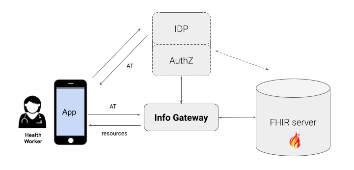

# Concepts

## Common Terminologies

These are some common terminologies that are important when dealing with access
control in general:

| Term                                                    | Description                                                                                                              |
| ------------------------------------------------------- | ------------------------------------------------------------------------------------------------------------------------ |
| Authentication and Identity Provider (IDP)              | Who the user is. Establishing the identity can be done through a shared service (e.g., Google, GitHub) or a special one. |
| Authorization (AuthZ)                                   | Given the identity, what can a user access? Has context specific pieces (e.g., scopes)                                   |
| Access-control                                          | How to make sure users access authorized resources only. This is the **core focus of the info gateway**.                 |
| Client app                                              | An app which needs to access FHIR resources on behalf of a user.                                                         |
| User                                                    | The user that is using the app; this is the identity being "authenticated".                                              |
| Access Token                                            | A JWT that is provided as a Bearer token when accessing FHIR resources.                                                  |
| OAuth2.0                                                | A standard to grant access to an application on behalf of a user.                                                        |
| [SMART-on-FHIR](https://hl7.org/fhir/smart-app-launch/) | Defines workflows that an application can use to securely request and access FHIR data.                                  |

The following picture helps to visualise the relationship of these concepts. A
client app (e.g., a SMART-on-FHIR app) should first use a process to fetch an
_"access token"_ from the IDP+AuthZ service. For example, this process might be
OAuth's
[Authorization Code Flow](https://auth0.com/docs/get-started/authentication-and-authorization-flow/authorization-code-flow).
This token is then provided on each request to the access-control gateway when
accessing FHIR resources.



## Info Gateway Modules

The Info Gateway consists of a core, which is in the
[`server`](https://github.com/google/fhir-gateway/tree/main/server) module, and
a set of _access-checker_ plugins, which can be implemented by third parties and
added to the proxy server. Two sample plugins are implemented in the
[`plugins`](https://github.com/google/fhir-gateway/tree/main/plugins) module.

There is also a sample
[`exec`](https://github.com/google/fhir-gateway/tree/main/exec) module which
shows how all pieces can be woven together into a single Spring Boot app. It
also has examples for implementing custom end-points.

**Notes:**

- [1] Spring Boot is not a requirement for using FHIR Info Gateway; we just use
  it to simplify the
  [MainApp](https://github.com/google/fhir-gateway/tree/main/exec/src/main/java/com/google/fhir/gateway/MainApp.java).
- [2] The only Spring-related requirement is to do a
  [@ComponentScan](https://docs.spring.io/spring-framework/docs/current/javadoc-api/org/springframework/context/annotation/ComponentScan.html)
  to find all access-checker plugins in the classpath.

## Configuration parameters

The configuration parameters are provided through environment variables:

- `PROXY_TO`: The base url of the FHIR server e.g.:

  ```shell
  export PROXY_TO=https://example.com/fhir
  ```

- `TOKEN_ISSUER`: The URL of the access token issuer, e.g.:

  ```shell
  export TOKEN_ISSUER=http://localhost:9080/auth/realms/test
  ```

  The above example is based on the default config of a test IDP+AuthZ
  [Keycloak](https://www.keycloak.org/) server. To see how this server is
  configured, check the
  [docker/keycloak](docker/https://github.com/google/fhir-gateway/tree/main/docker/keycloak)
  directory. If you want to use a SMART-on-FHIR (SoF) app use this realm instead
  which is based on Keycloak's
  [SoF extension](https://github.com/Alvearie/keycloak-extensions-for-fhir):

  ```shell
  export TOKEN_ISSUER=http://localhost:9080/auth/realms/test-smart
  ```

- `ACCESS_CHECKER`: The access-checker to use. Each access-checker has a name
  (see [plugins](https://github.com/google/fhir-gateway/tree/main/plugins) for
  details) and this variable should be set to the name of the plugin to use. For
  example, to use one of the sample plugins use one of:

  ```shell
  export ACCESS_CHECKER=list
  export ACCESS_CHECKER=patient
  ```

  For more information on how access-checkers work and building your own, see
  [section on access checkers](#access-checkers).

- `ALLOWED_QUERIES_FILE`: A list of URL requests that should bypass the access
  checker and always be allowed.
  [`AllowedQueriesChecker`](https://github.com/google/fhir-gateway/blob/main/server/src/main/java/com/google/fhir/gateway/AllowedQueriesChecker.java)
  compares the incoming request with a configured set of allowed-queries. The
  intended use of this checker is to override all other access-checkers for
  certain user-defined criteria. The user defines their criteria in a config
  file and if the URL query matches an entry in the config file, access is
  granted.
  [`AllowedQueriesConfig`](https://github.com/google/fhir-gateway/blob/main/server/src/main/java/com/google/fhir/gateway/AllowedQueriesConfig.java)
  shows all the supported configurations. An example config file is
  [`hapi_page_url_allowed_queries.json`](https://github.com/google/fhir-gateway/blob/main/resources/hapi_page_url_allowed_queries.json).
  To use this file with `ALLOWED_QUERIES_FILE`:

  ```shell
  export ALLOWED_QUERIES_FILE="resources/hapi_page_url_allowed_queries.json"
  ```

- `BACKEND_TYPE`: The type of backend, either `HAPI` or `GCP`. `HAPI` should be
  used for most FHIR servers, while `GCP` should be used for GCP FHIR stores.

## Access Checkers

FHIR Info Gateway uses _access checker plugins_ to define the logic it uses to
make decisions for access requests. Most users should create an access checker
plugin to implement the access control logic for a specific use case. You can
learn about access checker plugins by looking at the sample access checker
[plugins](https://github.com/google/fhir-gateway/tree/main/plugins/src/main/java/com/google/fhir/gateway/plugin).

See tutorial on
[creating an access checker plugin](tutorial_first_access_checker.md). The core
of FHIR Info Gateway, provides libraries that make it easier to create
access-checkers. For example,
[PatientFinder](https://github.com/google/fhir-gateway/blob/main/server/src/main/java/com/google/fhir/gateway/interfaces/PatientFinder.java)
can be used to limit access to a certain set of patients.

### Patient access checker plugin

The
[`PatientAccessChecker` plugin](https://github.com/google/fhir-gateway/blob/main/plugins/src/main/java/com/google/fhir/gateway/plugin/PatientAccessChecker.java)
can be used if the client is a SMART-on-FHIR app that uses the
[standalone app launch flow](https://www.hl7.org/fhir/smart-app-launch/app-launch.html#launch-app-standalone-launch).
It expects a `patient_id` claim in the access-token and limits access to FHIR
resources that belong to that patient. It supports
[SoF scopes](https://www.hl7.org/fhir/smart-app-launch/scopes-and-launch-context.html#scopes-for-requesting-clinical-data)
(both v1 and v2).

### Explore the List access checker plugin

The
[`ListAccessChecker` plugin](https://github.com/google/fhir-gateway/blob/main/plugins/src/main/java/com/google/fhir/gateway/plugin/ListAccessChecker.java)
is a simple example of list-based access control. It works by assigning each
user a [FHIR `List` resource](https://www.hl7.org/fhir/list.html) which contains
a list of references of `Patient` resources that the user should have access to.
When a client makes a request to FHIR Information Gateway, the
`ListAccessChecker` grants access if all patients that are referenced in the
query are on the user's patient access list.

The plugin expects the patient `List` resource's ID to be included as the value
to a claim named `patient_list` in the access token used to authorize requests
to the FHIR Information Gateway server. For example, following the
[test Docker deployment](https://github.com/google/fhir-access-proxy/wiki/Try-out-FHIR-Information-Gateway)
you may get a decoded JWT like the following (note if you use the default
settings you will get more claims that are not relevant to the access-checker
logic; so they are removed in this example):

```json
{
  "header": {
    "alg": "RS256",
    "typ": "JWT",
    "kid": "MnXk25Vp_W6X_UMi4sA3_iEMwuumZkwhOuE8eMY8LFo"
  },
  "payload": {
    "exp": 1673990497,
    "iat": 1673990197,
    "jti": "5bb2b1a0-e9c6-442f-abfd-a22f1798fd11",
    "iss": "http://localhost:9080/auth/realms/test",
    "aud": "account",
    "sub": "76315cd1-9681-4a4e-b733-e6d811058e40",
    "typ": "Bearer",
    "azp": "my-fhir-client",
    "session_state": "967e82a2-0188-4774-abbc-6bb4ce26536f",
    "acr": "1",
    "scope": "email profile",
    "sid": "967e82a2-0188-4774-abbc-6bb4ce26536f",
    "email_verified": false,
    "patient_list": "patient-list-example",
    "preferred_username": "testuser",
    "group": ["fhirUser"]
  }
}
```

Here `patient_list` equals `patient-list-example`, so if your FHIR server is at
`http://localhost:8099/fhir/` then this user's patient access list resource is
`http://localhost:8099/fhir/List/patient-list-example`.

The decoded JWT is passed to the
[`AccessCheckerFactory`](https://github.com/google/fhir-gateway/blob/main/server/src/main/java/com/google/fhir/gateway/interfaces/AccessCheckerFactory.java)
implementation's `create()` function. The `ListAccessChecker` implementation
extracts the patient list ID from the JWT and saves it internally. Custom JWT
claims in the access token can be a good way to pass additional information to
your access checker beyond what your authentication server provides.

`ListAccessChecker`'s
[`checkAccess`](https://github.com/google/fhir-gateway/blob/19447d7152804d2b790f22cc44ad3b1ca21c7040/plugins/src/main/java/com/google/fhir/gateway/plugin/ListAccessChecker.java#L157)
function splits access logic according to the HTTP method. Simple yes/no access
decisions like `processGet()` use the
[`NoOpAccessDecision`](https://github.com/google/fhir-gateway/blob/main/server/src/main/java/com/google/fhir/gateway/interfaces/NoOpAccessDecision.java)
class which you may also use in your own implementations. Alternatively, you may
have more complex decision needs, such as doing additional processing after the
data access like
[`processPost()`](https://github.com/google/fhir-gateway/blob/19447d7152804d2b790f22cc44ad3b1ca21c7040/plugins/src/main/java/com/google/fhir/gateway/plugin/ListAccessChecker.java#L202).
In this case, implement your own version of
[`AccessDecision`](https://github.com/google/fhir-access-proxy/blob/main/server/src/main/java/com/google/fhir/gateway/interfaces/AccessDecision.java).
The `ListAccessChecker` allows clients to create new `Patient` resources without
restriction (always allow access), and then as a post-processing step adds the
new Patient id to the client's patient access list. You can see this implemented
in
[`AccessGrantedAndUpdateList`](https://github.com/google/fhir-access-proxy/blob/main/plugins/src/main/java/com/google/fhir/gateway/plugin/AccessGrantedAndUpdateList.java).
