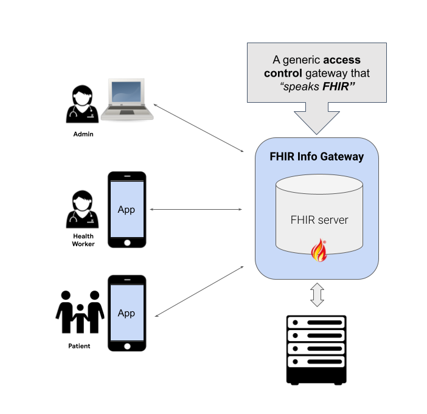

# FHIR Info Gateway

The Info Gateway is a reverse proxy which controls client access to FHIR
resources on a server. It works by inspecting FHIR requests and verifying that
the client is authorized to access the requested resources.

It makes it easier for developers to enforce various forms of authorization
policies including organizational role based access control (RBAC) policies when
working with FHIR data.

- To enable authorization and access-control (ACL) policy enforcement between a
  client application and a FHIR server, the Info Gateway is used along with an
  Identity Provider (IDP) and Authorization server (AuthZ).
- The IDP can be a generic OpenID Connect (OIDC) compliant service or a special
  purpose one.
- The IDP+AuthZ should provide a JSON Web Token (JWT) to the client. The client
  uses this as a Bearer access-token (AT) when sending FHIR requests.
- A sample end-to-end implementation with Keycloak as the IDP+AuthZ service is
  provided and has been tested with HAPI FHIR and Google Cloud Healthcare
  FHIR-store as the FHIR server.

## Key Features

Key features of the Info Gateway include:

- A stand-alone service that can work with any FHIR compliant servers.
- A pluggable architecture for defining an access-checker to allow for
  implementation configurability.
- Query filtering to block/allow specific queries.
- Post-processing of the results returned by the FHIR-server, for example to
  remove sensitive information.
- A generic interface for implementing custom endpoints, e.g., a sync endpoint
  to return updates for all patients assigned to a health-worker.

## Common use cases

The Info Gateway is designed to solve for a generic problem, that is, access
control for **any client** and **any FHIR server**.

Common access-check use-cases include:

1. For a mobile app used by community based front-line health workers possibly
   with offline support
2. Web based dashboard used by program admins
3. For a personal health record app used by patients or caregivers
4. To enable SMART-on-FHIR apps for patient or system level scopes

FHIR Info Gateway is implemented as a "FHIR facade", i.e., it is a FHIR server
itself which is implemented using the
[HAPI FHIR Plain Server](https://hapifhir.io/hapi-fhir/docs/server_plain/introduction.html)
library:

